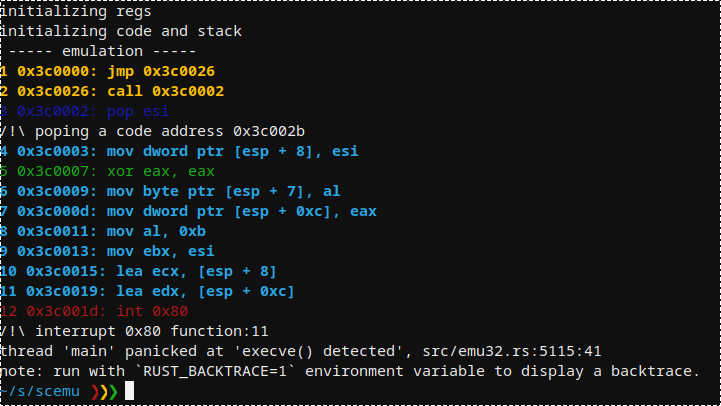
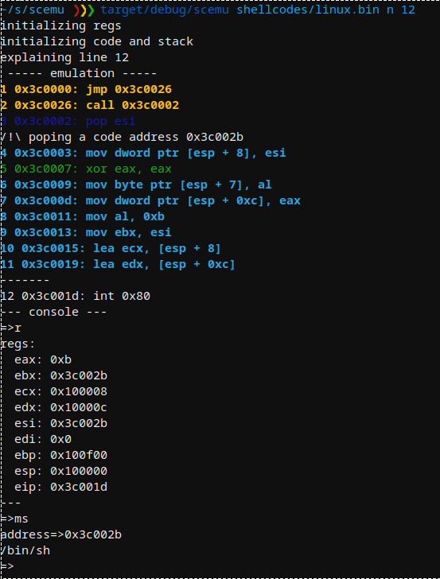
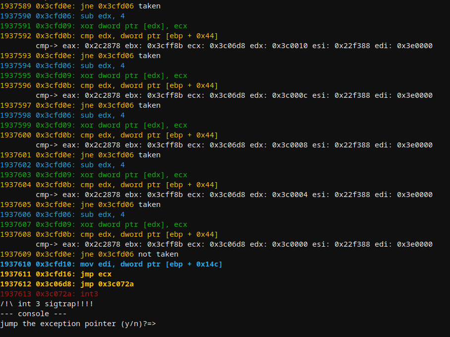
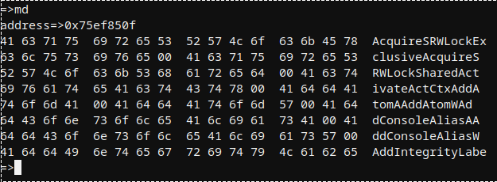
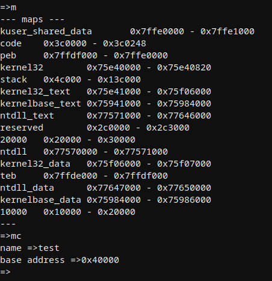

# scemu
x86 32bits emulator, for securely emulating shellcodes 

- rust safety, good for malware.
- rust speed, 18,750 instructions per second
- iteration detector
- colorized
- stop at specific moment and explore the state or modify it.
- 90 instructions implemented
- SEH chains
- vectored exception handler
- int3
- non debugged cpuid

Some use cases:

scemu emulates a simple shellcode detecting the execve() interrupt.

We select the line to stop and inspect the memory.

After emulating near 2 million instructions of GuLoader win32 in linux, faking cpuid's and other tricks in the way, arrives to a sigtrap to confuse debuggers. 

Example of memory dump on the api loader.

There are several maps by default, and can be created more with apis like LoadLibraryA or manually from the console.

