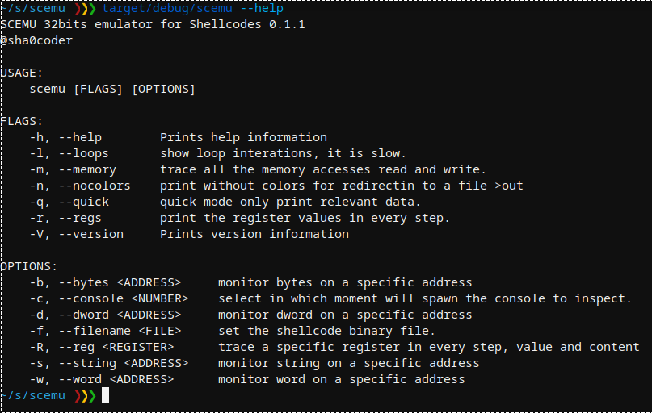

# scemu
x86 32bits emulator, for securely emulating shellcodes 

## Features
- rust safety, good for malware. All dependencies are in rust.
- very fast emulation (much faster than unicorn) 100.000 instructions/second printing every instruction.
- powered by iced-x86 rust dissasembler awesome library.
- iteration detector.
- memory tracking.
- colorized.
- stop at specific moment and explore the state or modify it.
- 77 instructions implemented.
- 49 winapi implemented of 5 dlls.
- 200 first linux syscalls.
- SEH chains.
- vectored exception handler.
- int3.
- non debugged cpuid.
- zero unsafe{} blocks.
- tests with known payloads:
	- metasploit shellcodes
	- metasploit encoder
	- cobalt strike
	- guloader (not totally for now)

## TODO
	- more fpu
	- mmx
	- 64 bits
	- scripting?
	- stagers: get next stage

## Usage

## Some use cases

scemu emulates a simple shellcode detecting the execve() interrupt.

We select the line to stop and inspect the memory.

After emulating near 2 million instructions of GuLoader win32 in linux, faking cpuid's and other tricks in the way, arrives to a sigtrap to confuse debuggers. 

Example of memory dump on the api loader.

There are several maps by default, and can be created more with apis like LoadLibraryA or manually from the console.

Emulating basic windows shellcode based on LdrLoadDLl() that prints a message:

The console allow to view an edit the current state of the cpu:

The cobalt strike api loader is the same that metasploit, emulating it:

Cobalt Strike API called:

Metasploit rshell API called:

Metasploit SGN encoder using few fpu to hide the polymorfism:

Metasploit shikata-ga-nai encoder that also starts with fpu:

